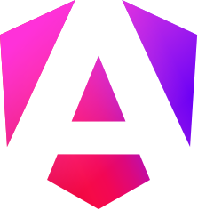
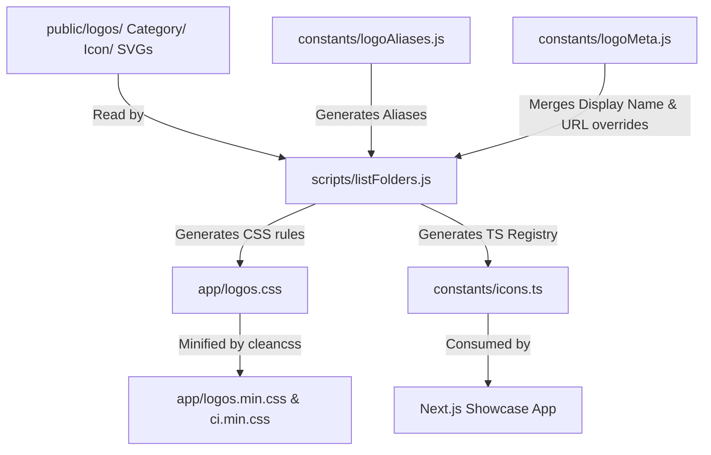

# Coloured Icons 🎨

> A lightweight, zero-configuration CSS icon library for brand, technology, and animal logos, served directly from a global CDN.

[](https://coloured-icons.vercel.app)
[](LICENSE)

---

### Sample Icons

<p align="left">
   &nbsp;
   &nbsp;
   &nbsp;
   &nbsp;
   &nbsp;
   &nbsp;
   &nbsp;
   &nbsp;
   &nbsp;
   &nbsp;
   &nbsp;
   &nbsp;
   &nbsp;
   &nbsp;
   &nbsp;
   &nbsp;
   &nbsp;
   &nbsp;
   &nbsp;
  
</p>

Throw in a CDN link and watch the magic happen! No need to install heavy npm packages or deal with local assets; just use a simple `<i>` tag. Coloured Icons hosts hundreds of brand, animal, tech, and tool logos, all styled with familiar class names.

---

## 🚀 Installation & Usage

To use the Coloured Icons library, simply add one of the following CDN links to your HTML file:

### Using a fixed version release (Recommended for production):
```html
<link
  rel="stylesheet"
  href="https://cdn.jsdelivr.net/gh/dheereshag/coloured-icons@1.9.7/app/ci.min.css"
/>
```

### Using the latest changes from the master branch:
```html
<link
  rel="stylesheet"
  href="https://cdn.jsdelivr.net/gh/dheereshag/coloured-icons@master/app/ci.min.css"
/>
```

### Basic HTML usage:
```html
<i class="ci ci-spotify ci-2x"></i>
```

---

## 🎨 Styles & Variations

### 1. Inverting Colors
If you want to invert the colors (useful for contrasting themes), add the `ci-invert` class:
```html
<i class="ci ci-postman ci-2x ci-invert"></i>
```

### 2. Sizing
We adopt Font Awesome's sizing conventions using relative units (`rem`):
* **Standard scales**: `ci-2xs` (0.625rem), `ci-xs` (0.75rem), `ci-sm` (0.875rem), `ci-md` (1rem), `ci-lg` (1.25rem), `ci-xl` (1.5rem), `ci-2xl` (2rem)
* **Multiplier scales**: `ci-1x` to `ci-10x` (1rem to 10rem)

For more details on sizing classes, you can refer to the [Font Awesome Icon Size Documentation](https://fontawesome.com/docs/web/style/size).

### 3. Dark and Light Variants
By default, standard class names like `ci-nextjs` point to the dark logo variant (intended for light backgrounds). If a brand provides a light variant (intended for dark backgrounds), append `-light` to the class:
* `ci-nextjs` (Dark logo variant for light backgrounds)
* `ci-nextjs-light` (Light logo variant for dark backgrounds)

### 4. Layout Variations
We support horizontal, vertical, and wordmark logos where available:
* **Wordmark (text only)**: `ci-infura-wordmark`
* **Horizontal / Inline (icon left, text right)**: `ci-whatsapp-horizontal` (or `ci-whatsapp-inline`)
* **Vertical / Stacked (icon top, text bottom)**: `ci-whatsapp-vertical` (or `ci-whatsapp-stacked`)

---

## ⚙️ Architecture & Build Pipeline

The repository utilizes a **two-tier architecture**: a core CSS asset builder/CDN compiler, and a Next.js 16 showcase app.



### Dynamic Asset Parsing & CSS Generation (`scripts/listFolders.js`)
When running `pnpm dev` or `pnpm build`, a custom Node.js script automatically scans the `public/logos/` directory:
1. **File Grouping**: Groups SVGs under `public/logos/<category>/<icon-name>/` by their base name, mapping light/dark variants and layout variants.
2. **Selector Resolution**: Resolves target class names and maps aliases defined in `constants/logoAliases.js` (e.g. `ts` for `typescript`, `fb` for `facebook`).
3. **CSS Generation**: Writes rules mapping classes to the SVG path via the CSS `content: url(...)` attribute.
4. **Alphabetical Sorting**: To prevent erratic Git diffs, it groups and sorts the generated selectors alphabetically by their SVG URL.
5. **Metadata Syncing**: Automatically updates `constants/icons.ts`, updating the display names and URLs from metadata overrides in `constants/logoMeta.js`.

---

## ⚡ Performance & Developer Experience (DX) Optimizations

This codebase implements several advanced optimization techniques:

### 1. Lazy-Loading Vector CDN Assets (Zero-JS Footprint)
Instead of bundling SVGs directly into Javascript bundles (which bloats bundle sizes and prevents caching), we load them lazily using CSS:
* **CSS `content` property**: The CDN serves a single CSS file. The browser downloads individual SVG files *only if* the selector matches an element in the DOM. This results in **zero JS bundle bloat** for the icons.

### 2. Development Mode Render Capping (`limitIconsInDev`)
Rendering thousands of SVGs in a local development environment causes massive Hot Module Replacement (HMR) lags and React reconciliation bottlenecks.
* **Solution**: In `lib/dev-utils.ts`, we check if `NODE_ENV === 'development'`. If true, the `limitIconsInDev` utility limits the showcase catalog to **10 icons per category**. This keeps local hot reloads under **50ms**.

### 3. Next.js & React 19 Compiler
* **React Compiler**: Enabled via `reactCompiler: true` in `next.config.js`. It parses the AST to compile-in automatic memoization, eliminating the overhead of manual `useMemo` or `useCallback` for most components.
* **Debounced Filtering**: In `hooks/useFilteredIcons.ts`, we implement a **200ms debounce** on search input state to prevent layout thrashing and expensive re-filtering operations on every keystroke.

### 4. Minification Pipeline
The `pnpm minify` command uses `clean-css-cli` to compress the generated `logos.css` and the base `ci.css` utility stylesheet. This reduces the network transit size of the CDN library by over **70%**.

---

## 👨‍💻 Technical Interview Q&A (Prep Guide)

Use this guide to confidently explain the project's engineering design and trade-offs in interviews:

### Q1: What is the overall architecture of this project?
> **Answer:** This is a **static asset compilation library** combined with a **Next.js static web application showcase**. The library assets (SVGs) are stored in `public/logos/`. We use a custom Node.js pre-build script (`scripts/listFolders.js`) that acts as a compiler. It scans the files, generates corresponding CSS classes with URL pointers to the assets, and generates a TypeScript metadata catalog. The output CSS files (`ci.min.css` and `logos.min.css`) are hosted on GitHub and distributed globally via the jsDelivr CDN.

### Q2: Why use CSS `content: url(...)` rather than WebFonts (like FontAwesome) or inline React SVG components?
> **Answer:**
> 1. **WebFonts vs. CSS URLs**: Custom WebFonts require loading the *entire* font file (containing hundreds of glyphs) before a single icon can render, which harms the Largest Contentful Paint (LCP) metric. CSS URLs load assets lazily, fetching only the specific SVG files parsed in the current viewport.
> 2. **Inline SVGs vs. CSS URLs**: Inline SVGs inflate the HTML/JS document bundle size and prevent browser caching. Utilizing `content: url(...)` allows the browser to cache each SVG asset independently.

### Q3: How did you optimize the local development environment for hot reloading (HMR) with thousands of assets?
> **Answer:** Under `lib/dev-utils.ts`, we created a utility called `limitIconsInDev`. It intercepts the icon array in development mode (`process.env.NODE_ENV === "development"`) and slices the catalog to a maximum of 10 icons per category. This reduces the DOM element count from thousands to less than a hundred, accelerating Next.js HMR recompilation and browser paint times during local iteration.

### Q4: Explain the dynamic generation script (`listFolders.js`) and how it handles variants.
> **Answer:** The script reads the directory structure of `public/logos/<category>/<icon-name>`. For each icon folder, it groups files by their base name (ignoring the `-light` suffix). It checks if there is a default base logo, light-mode variations, or layout variants (`horizontal`/`inline`, `vertical`/`stacked`, `wordmark`). It maps these variations to respective CSS classes and appends any aliases specified in `logoAliases.js`. Finally, to prevent random diffs in Git, it parses the generated CSS and sorts the classes alphabetically by URL.

### Q5: How is search and filtering optimized in the Next.js showcase UI?
> **Answer:** In `hooks/useFilteredIcons.ts`, we decouple the direct search input state from the filtering logic by introducing a 200ms debounce (`useDebounce`). The filtered icons are computed using `useMemo` and cached until the debounced search text or category changes. In addition, the Next.js application has the experimental React Compiler enabled, which compiles automatic rendering memoization directly into the bundle, reducing manual boilerplate.

### Q6: What is Tailwind CSS v4's configuration approach, and how is it used here?
> **Answer:** Tailwind CSS v4 shifts from a JS-based configuration (`tailwind.config.js`) to a CSS-first design system using CSS variables and the `@theme` directive. In this project, we define customized values (such as typography scales and sizing limits) within `@theme` inside `app/globals.css`, and load our custom `ci.css` styles directly into Tailwind's utility layer via `@import "./ci.css" layer(utilities);`.

---

## 🤝 Contribution Guidelines

### Adding a New Icon
1. Create a folder: `public/logos/<category>/<icon-name>/`
2. Save SVG files using this naming convention:
   * `<name>.svg` — Default dark-mode/colored logo (used for light backgrounds)
   * `<name>-light.svg` — Light-mode logo (used for dark backgrounds)
   * `<name>-horizontal.svg` — Wordmark + icon side-by-side
   * `<name>-vertical.svg` — Wordmark above/below the icon (or `-stacked`)
   * `<name>-wordmark.svg` — Text-only brand name
3. Add aliases in `constants/logoAliases.js` and display names/URL overrides in `constants/logoMeta.js` if necessary.
4. Run `pnpm dev` or `pnpm build` — the scripts will compile and build the configuration automatically.

### Developer Commands
```bash
pnpm dev        # Compile logos.css then start Next.js dev server
pnpm build      # Compile logos.css then build Next.js for production
pnpm lint       # Run ESLint checking
pnpm minify     # Minify logos.css -> logos.min.css and ci.css -> ci.min.css
```

---

## 📄 License

The Coloured Icons Library is licensed under the MIT License. Please review the LICENSE file for more details.

## 📬 Contact 👋🏻

[Visit my personal website](https://dheereshag.vercel.app)
